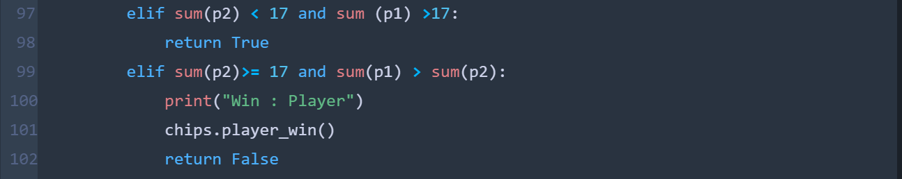
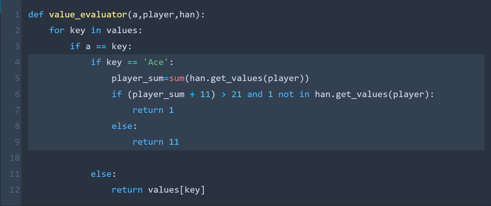
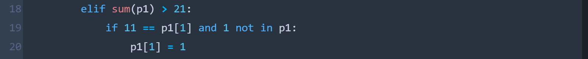
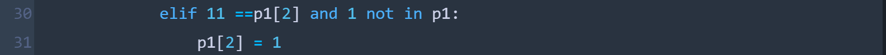

# **BLACK JACK**

A card gambling game made by Hardik Deshmukh in Python

**THE DECK OF CARDS**

The game uses the deck of 52 cards which is shuffled at the beginning of the game.The cards are fetched from the top of the deck to distribute among the player and the dealer.At the beginning of the game the player and the dealer gets 2 cards each.The player&#39;s both the cards are faced up and dealer&#39;s one card is faced down.

**OBJECTIVE OF THE GAME**

The participant tries to beat the dealer by getting a count as close as possible to 21, without going over 21.

**CARD VALUES/SCORING**

The Ace is worth 11 or 1 depends on the circumstances (explained in ace conditions section in detail).Face cards worth 10 and the rest of the other cards are worth its pip value.

**BETTING**

The player places a bet in terms of chips but before betting the player enters the amount of chips he or she wants to use.If the player wins he gets to keep double the amount of his bet and if the player looses(bursts) his bet chips will be taken away by the dealer.If there is a tie(push) the bet money is returned to the player.

**NATURALS**

If the player&#39;s first two cards are ace and ten-card, making total of 21 in two cards then it is a natural win or &quot;blackjack&quot;.If dealer first two cards make a total of 21 then the dealer is natural winner. If the dealer and player both have ace and ten-card then it is a tie (push).

**THE PLAYER&#39;S PLAY**

The player goes first and must decide whether to &quot;hit&quot; (ask for a card from deck) or &quot;stand&quot; (not ask for a card and end of player&#39;s turn).The player makes hit choice in an attempt to make count closer to 21 and stand to avoid getting &quot;burst&quot; (when the sum of cards of a player goes beyond 21 then the player loses). Blackjack game provides more than 2 functions, which are splitting pairs, doubling down, insurance and settlement, but for the sake of simplicity, these choices are not made in the constructed game.

**THE DEALER&#39;S PLAY**

When it is dealers&#39;s turn, the dealers face down card is turned up.The dealer is given same choices whether to &quot;hit&quot; or &quot;stand&quot; and this decision is made based on the circumstances (explained in dealer conditions section).

**BASIC STRATEGY**

The player has to try to make a total of 21 or close to 21.The player should &quot;hit&quot; if he or she thinks the total of dealer&#39;s face up and face down cards makes total value more than the player. If the player draws a card which makes his cumulative total to be more than 21 than the player &quot;burst&quot; and loses the betted chips. The player should stand if the cumulative total is more than 17, guessing that the dealer must be having total of two cards less than their cumulative total and above 16 or the player guesses the dealer has less than 17 and after fetching card(s) the dealer&#39;s total would be greater than 16 and less than the player&#39;s total.If the above circumstances come true the player wins.

The dealer also has to make a total of 21 or close to 21. The dealer has two choices as mentioned before (&quot;hit&quot; or &quot;stand&quot;). The dealer keeps hitting if the player&#39;s total is less than 17 and the dealer&#39;s total is less than player&#39;s and then finally stands when dealer&#39;s total is more than player&#39;s. If the player&#39;s total is more than 16 and dealer&#39;s total is less than 17 then the dealer keeps hitting until (stands) its total is above 16.

**THE DEALER&#39;S CONDITIONS**

If the total of dealer&#39;s card is 17 or more then it must stand and if the total is 16 or under then the dealer must take the card. The dealer must continue to take the cards until the cumulative amount is 17 or more, at which stage the dealer must stop. If the dealer has an ace and counts it as 11, bringing the total to 17 or more (but not more than 21), the dealer must count the ace as 11 and stand.

**CASE 1** :

The player &quot;stands&quot; with the total of 19 and now the dealer plays

Initial state:

&nbsp;&nbsp;&nbsp;&nbsp;&nbsp;&nbsp;Two of Clubs = 2

&nbsp;&nbsp;&nbsp;&nbsp;&nbsp;&nbsp;King of Hearts = 10

&nbsp;&nbsp;&nbsp;&nbsp;&nbsp;&nbsp;Making a total of 12

On Hit (1):

&nbsp;&nbsp;&nbsp;&nbsp;&nbsp;&nbsp;Two of Clubs = 2

&nbsp;&nbsp;&nbsp;&nbsp;&nbsp;&nbsp;King of Hearts = 10

&nbsp;&nbsp;&nbsp;&nbsp;&nbsp;&nbsp;Six of Clubs = 6

&nbsp;&nbsp;&nbsp;&nbsp;&nbsp;&nbsp;Making a total of 18 and &quot;stands&quot;

**CASE 2** :

The player &quot;stands&quot; with the total of 15 and now the dealer plays

Initial state:

&nbsp;&nbsp;&nbsp;&nbsp;&nbsp;&nbsp;Ten of Clubs = 10

&nbsp;&nbsp;&nbsp;&nbsp;&nbsp;&nbsp;Four of Hearts = 4

&nbsp;&nbsp;&nbsp;&nbsp;&nbsp;&nbsp;Making a total of 14

On Hit (1):

&nbsp;&nbsp;&nbsp;&nbsp;&nbsp;&nbsp;Ten of Clubs = 10

&nbsp;&nbsp;&nbsp;&nbsp;&nbsp;&nbsp;Four of Hearts = 4

&nbsp;&nbsp;&nbsp;&nbsp;&nbsp;&nbsp;Two of Clubs = 2

&nbsp;&nbsp;&nbsp;&nbsp;&nbsp;&nbsp;Making a total of 16 and the dealer wins

**CODE SNIPPET**

If the player&#39;s stand cumulative total is above 16 and dealer has total below 17 then dealer keeps hitting until its total value is above 16 and then stands or wins if its total is more than player&#39;s. Within the _win\_or\_bust_ function this condition is defined.

  

**THE ACE CONDITIONS**

The combination of an ace with a card other than a ten-card is known as a &quot;soft hand,&quot; because the player can count the ace as a 1 or 11, and either draw cards or not. Only when the cards add up to 21 or less is an ace considered hard or heavy. The ace is forced to get a 1 (hard) rating when the other cards reach 10 when inserted. Aces are counted as 11 when the cards would not make the total more than 21.If two aces exist, then only one (at most) can be counted as 11.

Aces are otherwise numbered as 1:

**CASE 1** : Single Ace card

Initial state:

&nbsp;&nbsp;&nbsp;&nbsp;&nbsp;&nbsp;Six of Clubs = 6

&nbsp;&nbsp;&nbsp;&nbsp;&nbsp;&nbsp;Ace of Hearts = 11

&nbsp;&nbsp;&nbsp;&nbsp;&nbsp;&nbsp;Making a total of 17

On Hit (1):

&nbsp;&nbsp;&nbsp;&nbsp;&nbsp;&nbsp;Six of Clubs = 6

&nbsp;&nbsp;&nbsp;&nbsp;&nbsp;&nbsp;Ace of Hearts = 1

&nbsp;&nbsp;&nbsp;&nbsp;&nbsp;&nbsp;Ten of Clubs = 10

&nbsp;&nbsp;&nbsp;&nbsp;&nbsp;&nbsp;Making total of 17 and avoiding Burst by counting Ace as 1

**CASE 2** : Double Ace card

Initial state:

&nbsp;&nbsp;&nbsp;&nbsp;&nbsp;&nbsp;Three of Clubs = 3

&nbsp;&nbsp;&nbsp;&nbsp;&nbsp;&nbsp;Ace of Hearts = 11

&nbsp;&nbsp;&nbsp;&nbsp;&nbsp;&nbsp;Making a total of 14

On Hit (1):

&nbsp;&nbsp;&nbsp;&nbsp;&nbsp;&nbsp;Three of Clubs = 3

&nbsp;&nbsp;&nbsp;&nbsp;&nbsp;&nbsp;Ace of Hearts = 11

&nbsp;&nbsp;&nbsp;&nbsp;&nbsp;&nbsp;Two of Clubs = 2

&nbsp;&nbsp;&nbsp;&nbsp;&nbsp;&nbsp;Making total of 16

On Hit (2):

&nbsp;&nbsp;&nbsp;&nbsp;&nbsp;&nbsp;Three of Clubs = 3

&nbsp;&nbsp;&nbsp;&nbsp;&nbsp;&nbsp;Ace of Hearts = 1

&nbsp;&nbsp;&nbsp;&nbsp;&nbsp;&nbsp;Two of Clubs = 2

&nbsp;&nbsp;&nbsp;&nbsp;&nbsp;&nbsp;Six of Diamonds = 6

&nbsp;&nbsp;&nbsp;&nbsp;&nbsp;&nbsp;Making total of 12 and avoiding Burst by counting Ace as 1

On Hit (3):

&nbsp;&nbsp;&nbsp;&nbsp;&nbsp;&nbsp;Three of Clubs = 3

&nbsp;&nbsp;&nbsp;&nbsp;&nbsp;&nbsp;Ace of Hearts = 1

&nbsp;&nbsp;&nbsp;&nbsp;&nbsp;&nbsp;Two of Clubs = 2

&nbsp;&nbsp;&nbsp;&nbsp;&nbsp;&nbsp;Six of Diamonds = 6

&nbsp;&nbsp;&nbsp;&nbsp;&nbsp;&nbsp;Ace of Diamonds = 11

&nbsp;&nbsp;&nbsp;&nbsp;&nbsp;&nbsp;Making a total of 23 resulting in Burst as one of the two Aces can only be counted as 1

**CODE SNIPPET**

Within The _value\_evaluator_ function an ace condition is defined. While adding an ace, if the total is above 21, in the highlighted code snippet ,it will append value of ace as 1 if and only if there is no ace with value counted as 1 else it will append the values as 11.(Note: The values of cards are stored in a list and not added into a single variable)

**han.get\_values(player)** – fetches the list of values of player or dealer from Hand class

  

Example:

Initial state:

&nbsp;&nbsp;&nbsp;&nbsp;&nbsp;&nbsp;Nine of Clubs = 9

&nbsp;&nbsp;&nbsp;&nbsp;&nbsp;&nbsp;Ten of Hearts = 10

&nbsp;&nbsp;&nbsp;&nbsp;&nbsp;&nbsp;Making a total of 19

On Hit (1):

&nbsp;&nbsp;&nbsp;&nbsp;&nbsp;&nbsp;Nine of Clubs = 9

&nbsp;&nbsp;&nbsp;&nbsp;&nbsp;&nbsp;Ten of Hearts = 10

&nbsp;&nbsp;&nbsp;&nbsp;&nbsp;&nbsp;Ace of Clubs = 1

&nbsp;&nbsp;&nbsp;&nbsp;&nbsp;&nbsp;Making total of 20 and avoiding burst by counting ace as 1

If the player&#39;s first two cards contains an ace (counted as 11) and keeps playing (hit) in order to reach close to 21 and then receives a card resulting in total amount more than 21 then the first card is counted as 1. And if the player encounters another ace card later resulting in burst then second ace card is not counted as 1.

**p1** -contains list of values of player and in case of dealer **p2**

**p1[1]** and **p1[2]** - replaces ace in first two cards count of 11 as 1 respectively

  

…

  

